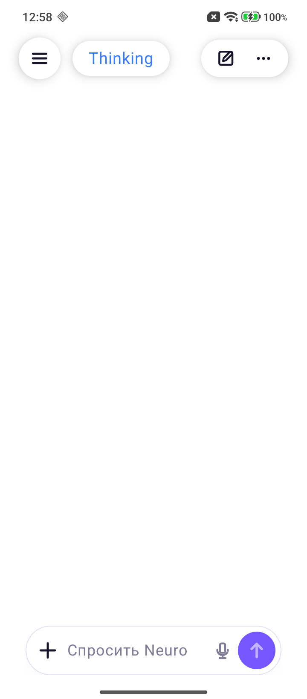

# Neuro

<p align="center">
  <strong>English</strong> | <a href="README_RU.md">Русский</a>
</p>

<p align="center">
  
</p>

<p align="center">
  <strong>A local-first Android AI companion for private, powerful everyday workflows.</strong>
</p>

Neuro is an actively developed offline-first AI assistant and portfolio project. It combines a native Android interface with local language models, persistent memory, image understanding, local image generation and voice transcription. The project is in its early stages, but the foundation is already usable and growing quickly.

## Screenshot

<p align="center">
  
</p>

## Why Neuro

- Local-first execution: personal chats and generated assets stay on your computer
- Native Android client built with Kotlin and Jetpack Compose
- Streaming responses over SSE
- Selectable local models through LM Studio
- Saved memory, personalization and recent-chat context
- Multimodal image understanding
- Local FLUX.2 Klein image generation with references and visual-review retries
- Fullscreen image viewer with zoom, bounded pan, download and share
- Faster Whisper voice transcription
- Runtime language selection for the interface and AI replies

## Languages

The interface has first-class translations for:

- Russian
- English
- Ukrainian

Neuro can also answer in German, Spanish, French, Italian, Portuguese, Polish, Turkish, Chinese and Japanese. These additional languages currently use the English UI fallback.

## Roadmap

Neuro is under active development. Planned directions include:

- Local music generation
- A more capable AI Agent for multi-step tasks
- More polished Android workflows
- Easier installation and model management
- Broader offline multimodal features

## Architecture

```text
Android app (Jetpack Compose)
        |
        | HTTP + SSE
        v
FastAPI backend
   |           |
   |           +--> FLUX.2 Klein worker
   |
   +--> LM Studio OpenAI-compatible API
   +--> Faster Whisper model
```

Large models, personal memory, generated images, uploads and local Python environments are intentionally kept outside Git.

## Requirements

- Windows 10 or newer
- Android Studio with Android SDK 34
- JDK 17
- Python 3.10
- LM Studio with its OpenAI-compatible local server enabled
- NVIDIA GPU recommended for local FLUX image generation

## Quick Start

### 1. Configure the Android client

Create your local Android configuration:

```powershell
Copy-Item local.properties.example local.properties
```

Set `sdk.dir` and your PC LAN address in `local.properties`:

```properties
neuro.serverUrl=http://192.168.1.10:3510
```

### 2. Configure LM Studio and the backend

Create a local backend configuration:

```powershell
Copy-Item run_server.local.bat.example run_server.local.bat
```

Update `PUBLIC_SERVER_URL` with the same LAN address. Set `LLM_BASE_URL` to your LM Studio endpoint.

### 3. Start the chat backend

```powershell
.\start_neuro.bat
```

The launcher creates `server\.venv`, installs backend dependencies and starts the API on port `3510`. If FLUX.2 Klein is already installed, it also starts local image generation automatically. The console prints one or more LAN addresses under `Введите в приложении`.

On the Android login screen, tap `Настроить подключение к ПК`, paste an address from the server console and tap `Проверить подключение`. The same setting remains available later under `Settings -> PC connection`.

### 4. Optional: install local image generation

```powershell
.\setup_flux_klein.bat
.\start_neuro.bat
```

This creates a separate image environment, downloads FLUX.2 Klein and starts both backend services.

### 5. Build the Android app

```powershell
.\gradlew.bat :app:assembleDebug
```

The APK is created at:

```text
app\build\outputs\apk\debug\app-debug.apk
```

## Tests

Run Android tests:

```powershell
.\gradlew.bat :app:testDebugUnitTest
```

Run backend tests:

```powershell
Push-Location server
.\.venv\Scripts\python.exe -m unittest test_image_routing.py
Pop-Location
```

## Privacy

Neuro is designed for a local setup. Do not commit:

- `local.properties`
- `run_server.local.bat`
- `server/storage*.json`
- `server/models/`
- `server/uploads/`
- `server/generated/`
- `server/.venv/`
- `server/.image_venv/`

These paths are already excluded by `.gitignore`.

## License

The source code is available under the [MIT License](LICENSE). You are welcome to use, modify and build on Neuro. Model weights and third-party dependencies remain subject to their own licenses.
