# Neuro

<p align="center">
  <strong>English</strong> | <a href="README_RU.md">Русский</a>
</p>

<p align="center">
  
</p>

<p align="center">
  <strong>A local-first Android AI companion for private, powerful everyday workflows.</strong>
</p>

Neuro is an actively developed offline-first AI assistant and portfolio project. It combines a native Android interface with local language models, persistent memory, image understanding, local image generation, voice transcription and an optional ACE-Step 1.5 music backend. The project is in its early stages, but the foundation is already usable and growing quickly.

## Screenshots

<p align="center">
  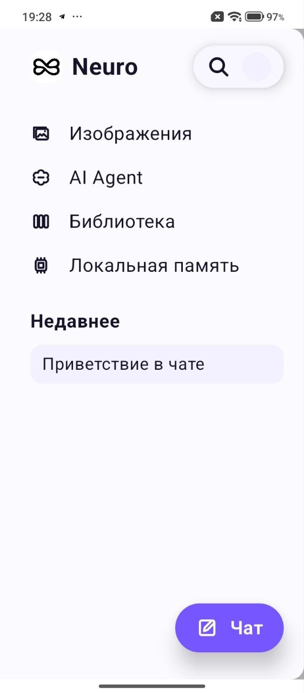
  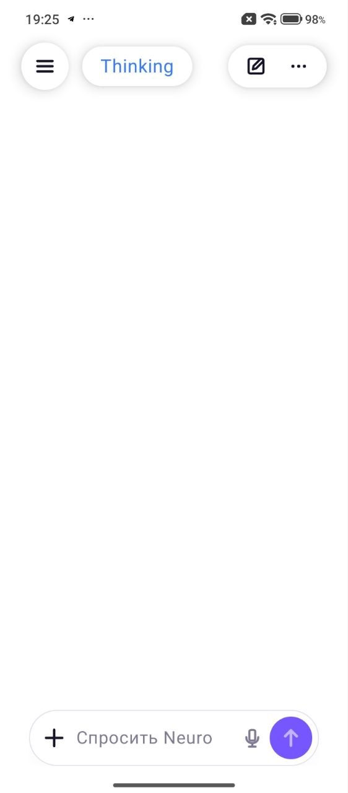
  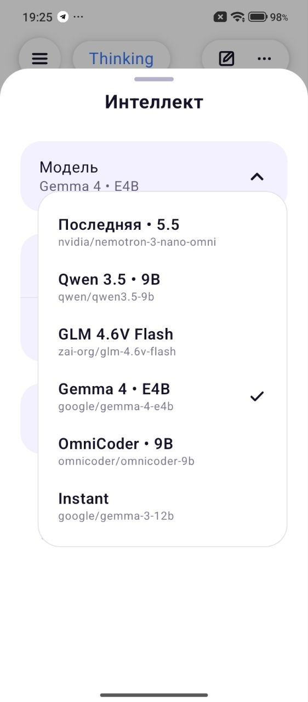
  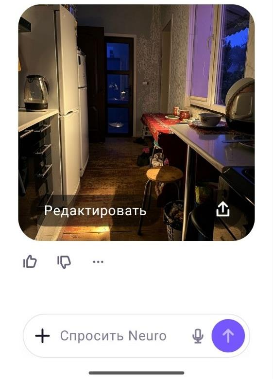
</p>

<p align="center">
  <em>Navigation, local chat, model routing and image editing directly inside the conversation.</em>
</p>

<p align="center">
  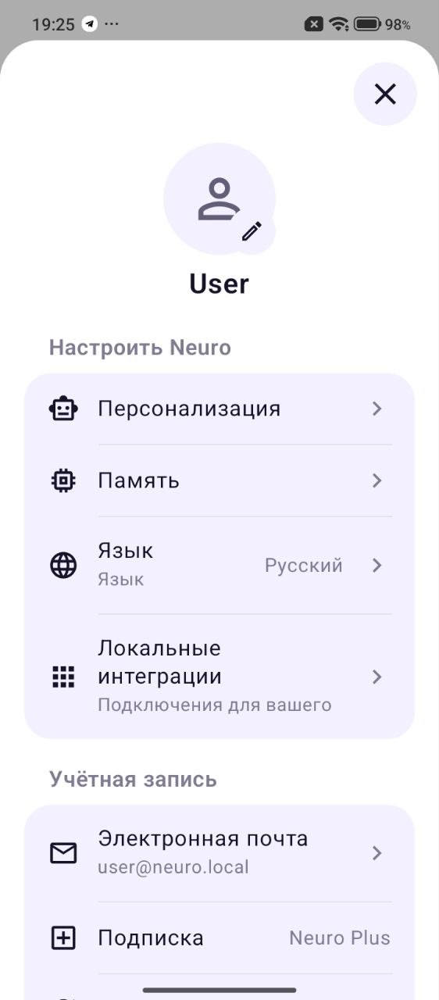
  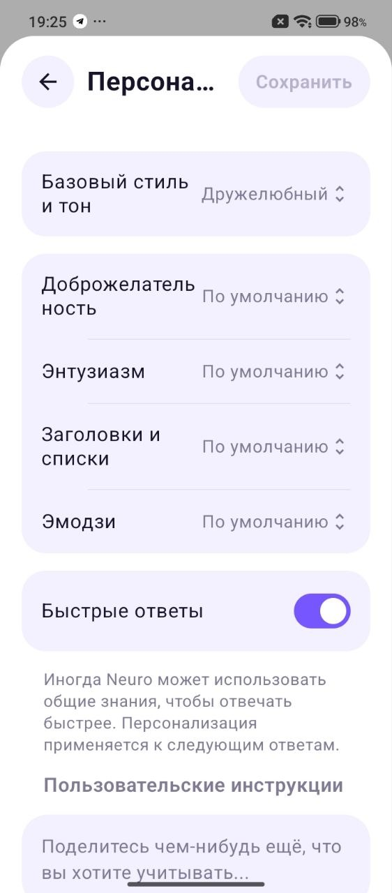
  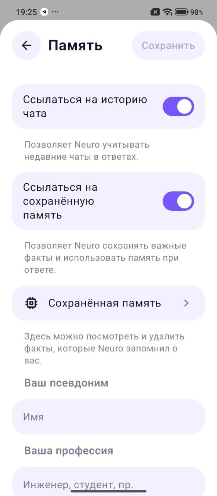
</p>

<p align="center">
  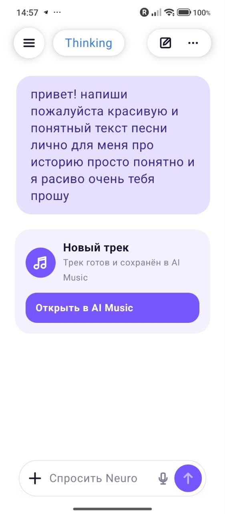
  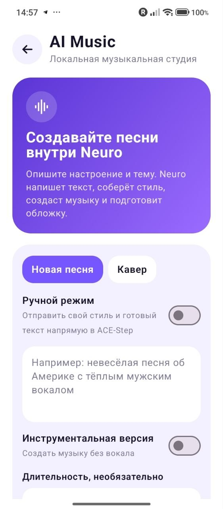
  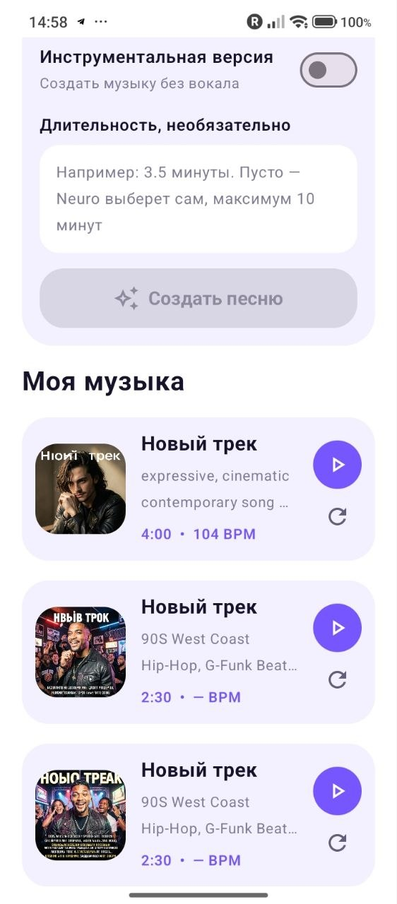
  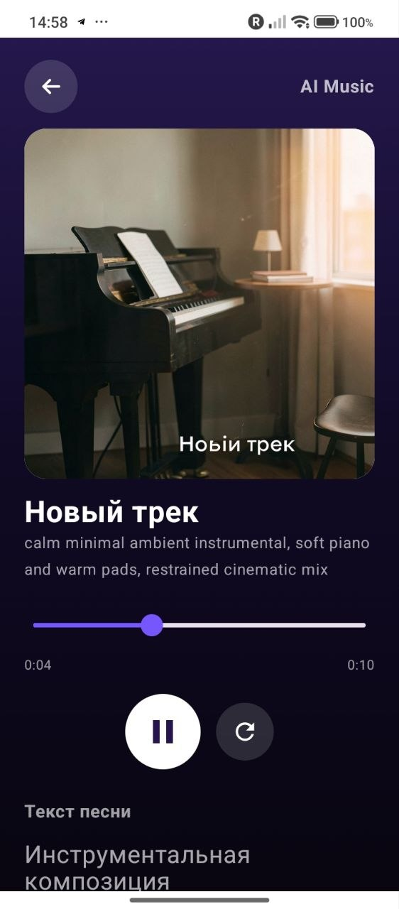
</p>

<p align="center">
  <em>AI Music can plan songs from chat, generate tracks locally, create covers, play lyrics and regenerate variants.</em>
</p>

## Why Neuro

- Local-first execution: personal chats and generated assets stay on your computer
- Native Android client built with Kotlin and Jetpack Compose
- Streaming responses over SSE
- Selectable local models through LM Studio
- Saved memory, personalization and recent-chat context
- Multimodal image understanding
- Local FLUX.2 Klein image generation with references and visual-review retries
- Fullscreen image viewer with zoom, bounded pan, download and share
- Faster Whisper voice transcription
- Local ACE-Step 1.5 song generation, audio covers, fresh artwork variants and synchronized lyrics
- Runtime language selection for the interface and AI replies

## Languages

The interface has first-class translations for:

- Russian
- English
- Ukrainian

Neuro can also answer in German, Spanish, French, Italian, Portuguese, Polish, Turkish, Chinese and Japanese. These additional languages currently use the English UI fallback.

## Roadmap

Neuro is under active development. Planned directions include:

- More music tools: stem workflows, stronger cover controls and arrangement editing
- A more capable AI Agent for multi-step tasks
- More polished Android workflows
- Easier installation and model management
- Broader offline multimodal features

## Architecture

```text
Android app (Jetpack Compose)
        |
        | HTTP + SSE
        v
FastAPI backend
   |           +--> FLUX.2 Klein image worker
   |           +--> ACE-Step 1.5 music worker
   |
   +--> LM Studio OpenAI-compatible API
   +--> Faster Whisper model
```

Large models, personal memory, generated images, uploads and local Python environments are intentionally kept outside Git.

## Requirements

- Windows 10 or newer
- Android Studio with Android SDK 34
- JDK 17
- Python 3.10
- Python 3.12 for optional ACE-Step 1.5 music generation
- LM Studio with its OpenAI-compatible local server enabled
- NVIDIA GPU recommended for local FLUX image generation

## Quick Start

### Fastest path for users

1. Download the latest APK from [GitHub Releases](https://github.com/nikitakazancevofficial-ops/Neuro/releases/latest) and install it on your Android phone.
2. Download or clone this repository on the Windows PC that will run the local AI backend.
3. Start LM Studio, enable the OpenAI-compatible local server on `http://127.0.0.1:1234/v1`, and load one of the recommended local chat models from the app model selector.
4. Double-click `start_neuro.bat`.
5. Copy the address shown in the console, for example `http://192.168.1.10:3510`, into `Settings -> PC connection` in the Android app.

`start_neuro.bat` is the normal one-file launcher. It keeps the main `Neuro Server`
console visible, prints the phone URL, starts optional FLUX and ACE-Step workers
when they are installed, and keeps logs in `server\neuro-server-current.*.log`.

### 1. Configure the Android client for development

Create your local Android configuration:

```powershell
Copy-Item local.properties.example local.properties
```

Set `sdk.dir` and your PC LAN address in `local.properties`:

```properties
neuro.serverUrl=http://192.168.1.10:3510
```

### 2. Configure LM Studio and the backend

Create a local backend configuration:

```powershell
Copy-Item run_server.local.bat.example run_server.local.bat
```

Update `PUBLIC_SERVER_URL` with the same LAN address. Set `LLM_BASE_URL` to your LM Studio endpoint.

### 3. Start the chat backend

```powershell
.\start_neuro.bat
```

The launcher creates `server\.venv`, installs backend dependencies and starts the API on port `3510`. If FLUX.2 Klein is already installed, it also starts local image generation automatically. The console prints one or more LAN addresses under `Введите в приложении`.
After startup, the launcher keeps a small `NEURO IS READY` window open with the
current phone URL. The main `Neuro Server` console remains visible so users can
see the backend status and logs. Closing the small information window does not
stop the services.

On the Android login screen, tap `Настроить подключение к ПК`, paste an address from the server console and tap `Проверить подключение`. The same setting remains available later under `Settings -> PC connection`.

### 4. Optional: install local image generation

```powershell
.\setup_flux_klein.bat
.\start_neuro.bat
```

This creates a separate image environment, downloads FLUX.2 Klein and starts both backend services.

### 5. Optional: prepare local music generation

```powershell
.\setup_acestep_music.bat
.\start_neuro.bat
```

This clones the official ACE-Step 1.5 source code, creates an isolated music
environment and downloads the official checkpoint. The backend already exposes
song generation, cover generation, progress, playback and lyric timeline
endpoints. Models and all heavy music caches stay under `E:\Portfolio\server`.
The installer links the official ACE-Step checkpoint directory to Neuro's model
directory so the first generation request does not download a duplicate copy.

`start_neuro.bat` also performs a system-drive preflight. If Windows recently
reported storage I/O retries, filesystem problems or critically low free space,
Neuro starts the lightweight chat backend without FLUX and ACE-Step until the
system SSD has been checked.

`start_neuro.bat` and `start_neuro_all.bat` start the chat backend, FLUX and ACE-Step together whenever
the system-drive preflight passes. There is intentionally no software override
while Windows reports storage-related crashes.
Heavy generation workers unload automatically after each result and restart on
demand. If LM Studio stalls while preparing a song, Neuro falls back to a local
music plan after 90 seconds instead of leaving the app stuck.
The AI Music screen also includes a direct manual mode for user-written styles
and lyrics with verse and chorus markers. Neuro chooses a natural duration for
each song unless the user enters one manually. The official ACE-Step runtime
supports songs up to 10 minutes. After synthesis, a local CPU Whisper pass aligns
the lyrics to the generated vocals for karaoke-style playback. Existing tracks
can be regenerated with the same style and lyrics to create a fresh musical
variant and a new semantically related cover image.
See [Music backend documentation](docs/MUSIC_BACKEND.md).

### 6. Build the Android app

```powershell
.\gradlew.bat :app:assembleDebug
```

The APK is created at:

```text
app\build\outputs\apk\debug\app-debug.apk
```

## Tests

Run Android tests:

```powershell
.\gradlew.bat :app:testDebugUnitTest
```

Run backend tests:

```powershell
Push-Location server
.\.venv\Scripts\python.exe -m unittest test_image_routing.py test_music_service.py
Pop-Location
```

## Privacy

Neuro is designed for a local setup. Do not commit:

- `local.properties`
- `run_server.local.bat`
- `server/storage*.json`
- `server/models/`
- `server/uploads/`
- `server/generated/`
- `server/.venv/`
- `server/.image_venv/`
- `server/vendors/`
- `server/music_uploads/`

These paths are already excluded by `.gitignore`.

## License

The source code is available under the [MIT License](LICENSE). You are welcome to use, modify and build on Neuro. Model weights and third-party dependencies remain subject to their own licenses.
